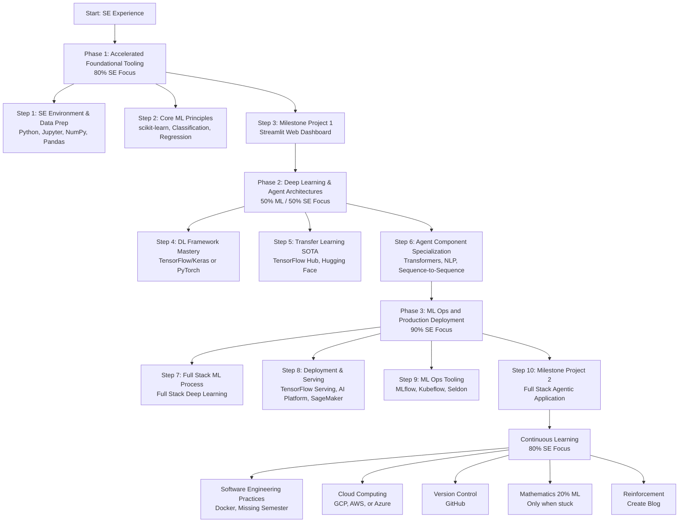

# 80/20 Agentic Developer Learning Roadmap

This plan is designed to leverage your **years of experience in software development** (Software 1.0) and prioritize the **80% Software Engineering (SE)** focus needed to build and deploy robust, agentic applications (Software 2.0), while dedicating the remaining **20% to core Machine Learning (ML)** principles.

For a builder, the key insight is that the majority of machine learning problems are actually **infrastructure problems**, merging software engineering with machine learning in what is called **ML Ops**. Your focus will be on accelerating through foundations to reach deep learning and production deployment (ML Ops) quickly.

## Roadmap Overview

## Detailed Learning Plan

### Phase 1: Accelerated Foundational Tooling (Approx. 80% SE Focus)

This phase rapidly ensures proficiency in the Python ecosystem required for ML, relying heavily on your existing software experience.

| Step | Focus Area | Detailed Activities & Tools | Resources |
| :--- | :--- | :--- | :--- |
| **1** | **SE Environment & Data Prep** | Confirm fluency in writing Python code in [Jupyter Notebooks](https://jupyter.org) or [Google Colab](https://colab.research.google.com) (a free resource). Master [NumPy](https://numpy.org) for numerical processing and [Pandas](https://pandas.pydata.org) for manipulating structured data (tables/spreadsheets). Numerical processing is fundamental as ML turns data into numbers. | [Python](https://www.python.org), [Jupyter](https://jupyter.org), [Google Colab](https://colab.research.google.com), [NumPy](https://numpy.org), [Pandas](https://pandas.pydata.org) |
| **2** | **Core ML Principles** | Introduce basic ML algorithms and functionality using [scikit-learn](https://scikit-learn.org). This provides a quick understanding of **classification** (is it X or Y?) and **regression** (predicting a number). The goal here is practice, not deep theory. | [Scikit-learn](https://scikit-learn.org), [Google ML Crash Course](https://developers.google.com/machine-learning/crash-course) |
| **3** | **Milestone Project 1** | Build **at least one end-to-end project**. Create a web dashboard or proof of concept using [Streamlit](https://streamlit.io). This immediately satisfies the goal of **building things** that people can use. | [Streamlit](https://streamlit.io), [GitHub](https://github.com) |

### Phase 2: Deep Learning & Agent Architectures (ML 50% / SE 50% Focus)

Agentic applications usually rely on **Deep Learning (DL)** architectures (like neural networks) to handle complex, unstructured data (like language and vision). This phase moves away from traditional data science toward the core components of agent building.

| Step | Focus Area | Detailed Activities & Tools | Resources |
| :--- | :--- | :--- | :--- |
| **4** | **DL Framework Mastery** | Select and practice using a Deep Learning framework ([TensorFlow/Keras](https://www.tensorflow.org) or [PyTorch](https://pytorch.org)). These are required to build and adapt complex neural networks. | [TensorFlow](https://www.tensorflow.org), [Keras](https://keras.io), [PyTorch](https://pytorch.org), [Fast.ai](https://www.fast.ai) |
| **5** | **Transfer Learning (SOTA)** | Master **Transfer Learning**, which allows you to take knowledge from a massive model and use it in your own project. Leverage **State of the Art (SOTA)** pre-trained models from [TensorFlow Hub](https://www.tensorflow.org/hub) or [Hugging Face Transformers](https://huggingface.co/transformers). This is vital because training large models is computationally intensive. | [TensorFlow Hub](https://www.tensorflow.org/hub), [Hugging Face Transformers](https://huggingface.co/transformers), [PyTorch Hub](https://pytorch.org/hub), [Papers with Code](https://paperswithcode.com) |
| **6** | **Agent Component Specialization** | Focus on architectures like **Transformers** (used heavily in NLP) found on [Hugging Face](https://huggingface.co/transformers). Study **sequence-to-sequence problems** (e.g., translation, speech commands). This domain is critical for building intelligent agents that interact via language. | [Hugging Face Transformers](https://huggingface.co/transformers), [DeepLearning.ai](https://www.deeplearning.ai) |

### Phase 3: ML Ops and Production Deployment (Approx. 90% SE Focus)

This phase is the heaviest concentration of software engineering practices, ensuring your agentic apps are deployable and reliable, rather than models that "die in Jupiter notebooks".

| Step | Focus Area | Detailed Activities & Tools | Resources |
| :--- | :--- | :--- | :--- |
| **7** | **Full Stack ML Process** | Learn the [Full Stack Deep Learning](https://fullstackdeeplearning.com) curriculum/concepts. Understand the continuous process loop: data collection, preparation, training, analysis, **serving**, and **retraining**. | [Full Stack Deep Learning](https://fullstackdeeplearning.com), [Made With ML](https://madewithml.com) |
| **8** | **Deployment & Serving** | Focus on how to **serve/deploy** the trained model. Explore tools like [TensorFlow Serving](https://www.tensorflow.org/tfx/guide/serving), [Google's AI Platform](https://cloud.google.com/ai-platform), or [AWS SageMaker](https://aws.amazon.com/sagemaker). Deployment is the real test of a machine learning model. | [TensorFlow Serving](https://www.tensorflow.org/tfx/guide/serving), [Google AI Platform](https://cloud.google.com/ai-platform), [AWS SageMaker](https://aws.amazon.com/sagemaker), [Azure ML](https://azure.microsoft.com/en-us/products/machine-learning) |
| **9** | **ML Ops Tooling** | Familiarize yourself with the tools required for machine learning operations (**ML Ops**) like [MLflow](https://mlflow.org), [Kubeflow](https://www.kubeflow.org), or [Seldon](https://www.seldon.io). This is essentially **DevOps for machine learning**. | [MLflow](https://mlflow.org), [Kubeflow](https://www.kubeflow.org), [Seldon](https://www.seldon.io), [DVC](https://dvc.org), [Weights & Biases](https://wandb.ai) |
| **10** | **Milestone Project 2 (Agentic App)** | Create and deploy a **Full Stack Agentic Application**. This project must utilize strong SE practices (e.g., containerization with [Docker](https://www.docker.com) and deployment via a cloud provider). | [Docker](https://www.docker.com), [GitHub](https://github.com), Cloud Providers (GCP/AWS/Azure) |

### Continuous Learning and Infrastructure (80% SE Focus)

These activities should be woven into your daily learning, reinforcing the software engineering foundation needed for production systems:

| Area | Activity & Rationale | Resources |
| :--- | :--- | :--- |
| **Software Engineering Practices** | Learn practices like [Docker](https://www.docker.com). Check resources like ["The Missing Semester"](https://missing.csail.mit.edu) curriculum, which teaches components often omitted from standard CS degrees. | [Docker](https://www.docker.com), [The Missing Semester](https://missing.csail.mit.edu), [Teach Yourself CS](https://teachyourselfcs.com) |
| **Cloud Computing** | Choose **one cloud provider** (GCP, AWS, or Azure) and become familiar with deploying resources. Cloud proficiency is necessary to get your code "out into the world". | [Google Cloud](https://cloud.google.com), [AWS](https://aws.amazon.com), [Azure](https://azure.microsoft.com), [A Cloud Guru](https://www.pluralsight.com/cloud-guru) |
| **Version Control** | Use tools like [GitHub](https://github.com) for version control to manage code and track changes. | [GitHub](https://github.com), [GitHub Pages](https://pages.github.com) |
| **Mathematics (20% ML Focus)** | Dedicate time to mathematics (**linear algebra, calculus, probability**) **only when you are stuck on a specific problem** or need to improve a model. Prioritizing application over upfront theory is the recommended approach for builders. | [Mathematics for ML Book](https://mml-book.github.io), [3Blue1Brown](https://www.3blue1brown.com/topics/linear-algebra), [Khan Academy](https://www.khanacademy.org) |
| **Reinforcement** | **Create your own blog** to write about what you are learning, as teaching others forces you to organize your thinking and reinforces understanding. | [GitHub Pages](https://pages.github.com), [Fast Pages](https://fastpages.fast.ai), [Medium](https://medium.com), [Rachel Thomas Blog Post](https://www.fast.ai/2020/01/16/fast_template) |

## Philosophy

Your learning journey is like **building a powerful custom vehicle**: your years of software experience provides the strong chassis (Software 1.0/80%), and the machine learning knowledge (20%) provides the specialized engine and navigation system needed to create an intelligent agent. The key is to start building immediately and focus the bulk of your effort on making that vehicle reliable, functional, and ready for the road (deployment).

---

# Machine Learning Resources Reference

**Note on Accessing Links:** All resources below are linked with their official URLs for easy access. Resources are organized by category to support the learning roadmap above.

## I. Core Roadmap & Supporting Materials

| Resource | Description / Purpose | Link |
| :--- | :--- | :--- |
| **The Mind Map / Road Map** | The machine learning flavoured visual interactive living mind map slash compass itself. | [Link provided below the video] |
| **GitHub Repo** | Contains a full version image of the roadmap and the slides. | [Link provided below the video] |
| **Whimsical** | The tool used to create the roadmap. | [https://whimsical.com](https://whimsical.com) |
| **TensorFlow Hub (TF Hub)** | A library for reusable machine learning modules. | [https://www.tensorflow.org/hub](https://www.tensorflow.org/hub) |
| **PyTorch Hub** | Offers pre-trained PyTorch models. | [https://pytorch.org/hub](https://pytorch.org/hub) |
| **Hugging Face Transformers** | The biggest open-source repository of Transformers (NLP architecture). | [https://huggingface.co/transformers](https://huggingface.co/transformers) |
| **Detectron2** | Facebook's open-source software for state-of-the-art object detection algorithms. | [https://github.com/facebookresearch/detectron2](https://github.com/facebookresearch/detectron2) |

## II. Foundational Software and Libraries

| Resource | Description / Purpose | Link |
| :--- | :--- | :--- |
| **Python** | The core programming language. | [https://www.python.org](https://www.python.org) |
| **Jupyter Notebooks** | Code spaces for writing and exploring machine learning code. | [https://jupyter.org](https://jupyter.org) |
| **Google Colab** | Code spaces for writing and exploring machine learning code. Colab is a free resource. | [https://colab.research.google.com](https://colab.research.google.com) |
| **NumPy (Numerical Python)** | Used for numerical processing, fundamental for turning data into numbers. | [https://numpy.org](https://numpy.org) |
| **Pandas** | Helps manipulate structured data (like tables and Excel spreadsheet type data). | [https://pandas.pydata.org](https://pandas.pydata.org) |
| **Scikit-learn** | A Python library containing algorithms and functionality for machine learning. | [https://scikit-learn.org](https://scikit-learn.org) |
| **TensorFlow** | A popular machine learning library. | [https://www.tensorflow.org](https://www.tensorflow.org) |
| **Keras** | A high-level deep learning library now part of TensorFlow 2.0. | [https://keras.io](https://keras.io) |
| **PyTorch** | Another key deep learning framework. | [https://pytorch.org](https://pytorch.org) |
| **TensorFlow.js** | For using TensorFlow on the web. | [https://www.tensorflow.org/js](https://www.tensorflow.org/js) |
| **TensorFlow Lite** | For TensorFlow on a mobile device or a small computer like a Raspberry Pi. | [https://www.tensorflow.org/lite](https://www.tensorflow.org/lite) |
| **ONNX (Open Neural Network Exchange)** | Converts models across different frameworks (TensorFlow, PyTorch). | [https://onnx.ai](https://onnx.ai) |
| **Anaconda** | Tools for managing Python code and environments. | [https://www.anaconda.com](https://www.anaconda.com) |
| **Conda** | Package and environment management system. | [https://docs.conda.io](https://docs.conda.io) |
| **Python Virtual Env** | Tools for managing Python code and environments. | [https://docs.python.org/3/library/venv.html](https://docs.python.org/3/library/venv.html) |

## III. ML Operations (ML Ops) and Experiment Tracking

| Resource | Description / Purpose | Link |
| :--- | :--- | :--- |
| **TensorBoard** | Helps visualize and analyze different machine learning experiments. | [https://www.tensorflow.org/tensorboard](https://www.tensorflow.org/tensorboard) |
| **Weights and Biases (W&B Dashboard)** | System for experiment tracking and a "must-have". | [https://wandb.ai](https://wandb.ai) |
| **W&B Artifacts** | Used to track dataset versions. | [https://docs.wandb.ai/guides/artifacts](https://docs.wandb.ai/guides/artifacts) |
| **Neptune AI** | Similar to W&B, used for tracking experiments. | [https://neptune.ai](https://neptune.ai) |
| **DVC (Data Version Control)** | Open-source version control system for machine learning projects. | [https://dvc.org](https://dvc.org) |
| **MLflow** | Open-source platform for managing the machine learning lifecycle. | [https://mlflow.org](https://mlflow.org) |
| **Kubeflow** | Open-source toolkit for managing machine learning workflows. | [https://www.kubeflow.org](https://www.kubeflow.org) |
| **Seldon** | Open-source platform for deploying machine learning models. | [https://www.seldon.io](https://www.seldon.io) |
| **Docker** | Recommended for software engineering practices and containerization. | [https://www.docker.com](https://www.docker.com) |

## IV. Deployment, Serving, and User Interface

| Resource | Description / Purpose | Link |
| :--- | :--- | :--- |
| **Streamlit** | The fastest way to build data apps, web dashboards, and proof of concepts. | [https://streamlit.io](https://streamlit.io) |
| **TensorFlow Serving** | Tools for model serving. | [https://www.tensorflow.org/tfx/guide/serving](https://www.tensorflow.org/tfx/guide/serving) |
| **PyTorch Serving** | Tools for model serving. | [https://pytorch.org/serve](https://pytorch.org/serve) |
| **Google's AI Platform (formerly ML Engine)** | Google Cloud's ML deployment tool, allows model to be available as a REST API. | [https://cloud.google.com/ai-platform](https://cloud.google.com/ai-platform) |
| **AWS SageMaker** | Amazon Web Services' ML deployment tool. | [https://aws.amazon.com/sagemaker](https://aws.amazon.com/sagemaker) |
| **Microsoft Azure Machine Learning** | Microsoft's ML deployment tool. | [https://azure.microsoft.com/en-us/products/machine-learning](https://azure.microsoft.com/en-us/products/machine-learning) |
| **GitHub** | Platforms recommended for version control and creating a blog. | [https://github.com](https://github.com) |
| **GitHub Pages** | Platforms recommended for version control and creating a blog. | [https://pages.github.com](https://pages.github.com) |
| **Fast Pages** | Platforms recommended for version control and creating a blog. | [https://fastpages.fast.ai](https://fastpages.fast.ai) |
| **Medium** | Platforms recommended for version control and creating a blog. | [https://medium.com](https://medium.com) |

## V. Auto ML and Explained Ability

| Resource | Description / Purpose | Link |
| :--- | :--- | :--- |
| **TPOT** | Automates the most tedious part of machine learning by intelligently exploring thousands of possible pipelines for scikit-learn algorithms. | [https://epistasislab.github.io/tpot](https://epistasislab.github.io/tpot) |
| **Google Cloud Auto ML** | Allows users to plug data into Google Cloud for automated model generation. | [https://cloud.google.com/automl](https://cloud.google.com/automl) |
| **Keras Tuner** | Helps tune Keras models. | [https://keras.io/keras_tuner](https://keras.io/keras_tuner) |
| **What-If Tool** | Helps visually probe the behavior of trained models with minimal coding, aiding in explained ability. | [https://pair-code.github.io/what-if-tool](https://pair-code.github.io/what-if-tool) |
| **SHAP (SHapley Additive exPlanations) values** | Uses game theory to explain the outputs of machine learning models. | [https://shap.readthedocs.io](https://shap.readthedocs.io) |

## VI. Mathematics Resources

| Resource | Description / Purpose | Link |
| :--- | :--- | :--- |
| ***Mathematics for Machine Learning*** **(Book)** | The number one recommended book for getting an overall concept of the math required. | [https://mml-book.github.io](https://mml-book.github.io) |
| **Three Blue One Brown (Linear Algebra)** | Video series recommended for learning linear algebra. | [https://www.3blue1brown.com/topics/linear-algebra](https://www.3blue1brown.com/topics/linear-algebra) |
| **Rachel Thomas's Computational Linear Algebra** | Focuses on learning linear algebra with code. | [https://github.com/fastai/numerical-linear-algebra](https://github.com/fastai/numerical-linear-algebra) |
| **Jeremy Howard's Book** | Provides the necessary bare-bones matrix calculus for deep learning. | [https://github.com/fastai/fastbook](https://github.com/fastai/fastbook) |
| **Khan Academy** | General resource great for math when needed. | [https://www.khanacademy.org](https://www.khanacademy.org) |

## VII. Courses, Curriculums, and Educational Resources

| Resource | Description / Purpose | Link |
| :--- | :--- | :--- |
| **Google's Machine Learning Crash Course (with TensorFlow)** | An open-source and free resource for concepts and processes. | [https://developers.google.com/machine-learning/crash-course](https://developers.google.com/machine-learning/crash-course) |
| **Elements of AI** | Another free resource for concepts and processes. | [https://www.elementsofai.com](https://www.elementsofai.com) |
| **Fast AI Part 1 / Curriculum** | Recommended for deep learning foundations. | [https://www.fast.ai](https://www.fast.ai) |
| **Deep Learning.ai Curriculum** | Recommended for deep learning practice. | [https://www.deeplearning.ai](https://www.deeplearning.ai) |
| **Full Stack Deep Learning** | A course/resource focused on taking models to production. | [https://fullstackdeeplearning.com](https://fullstackdeeplearning.com) |
| **Free Code Camp** | Recommended for learning Python and web development. | [https://www.freecodecamp.org](https://www.freecodecamp.org) |
| **Zero to Mastery Python Course (Andre)** | Teaches full-stack Python. | [https://zerotomastery.io/courses/learn-python](https://zerotomastery.io/courses/learn-python) |
| **"The Missing Semester" Curriculum** | Teaches general software engineering/computer science components often missed. | [https://missing.csail.mit.edu](https://missing.csail.mit.edu) |
| **Made With ML** | A phenomenal community-driven resource for tutorials, focusing on machine learning basics, algorithms, and full-stack development. | [https://madewithml.com](https://madewithml.com) |
| **Kaggle Learning Center** | Resources for data science education. | [https://www.kaggle.com/learn](https://www.kaggle.com/learn) |
| **Data Camp** | Resources for data science education. | [https://www.datacamp.com](https://www.datacamp.com) |
| **Data Quest** | Resources for data science education. | [https://www.dataquest.io](https://www.dataquest.io) |
| **Learning How to Learn (Coursera)** | Recommended courses on how to learn effectively. | [https://www.coursera.org/learn/learning-how-to-learn](https://www.coursera.org/learn/learning-how-to-learn) |
| **Learning How to Learn (ZTM)** | Recommended courses on how to learn effectively. | [https://zerotomastery.io](https://zerotomastery.io) |
| **A Cloud Guru** | Recommended for learning and getting certified in cloud services. | [https://www.pluralsight.com/cloud-guru](https://www.pluralsight.com/cloud-guru) |
| **Teach Yourself CS.com** | For those who want to "go really, really deep". | [https://teachyourselfcs.com](https://teachyourselfcs.com) |
| **Debug Link/ML Course (Zero to Mastery ML Course)** | The speaker's own machine learning course. | [https://zerotomastery.io/courses/machine-learning-and-data-science-bootcamp](https://zerotomastery.io/courses/machine-learning-and-data-science-bootcamp) |

## VIII. Books and Reading Materials

| Resource | Description / Purpose | Link |
| :--- | :--- | :--- |
| ***Hands-On Machine Learning with Scikit-Learn, Keras & TensorFlow*** **(Second Edition)** | Highly recommended; Part 1 for beginner concepts, Part 2 for the advanced path. | [Amazon](https://www.amazon.com/Hands-Machine-Learning-Scikit-Learn-TensorFlow/dp/1492032646) |
| ***Automate the Boring Stuff with Python*** | Recommended reading material. | [https://automatetheboringstuff.com](https://automatetheboringstuff.com) |
| ***Deep Learning for Coders*** | Upcoming book by the Fast AI teachers, Jeremy Howard and Sylveon Goga. | [https://www.amazon.com/Deep-Learning-Coders-fastai-PyTorch/dp/1492045527](https://www.amazon.com/Deep-Learning-Coders-fastai-PyTorch/dp/1492045527) |
| ***Building Machine Learning Pipelines*** | Upcoming book focused on full-stack machine learning. | [https://www.oreilly.com/library/view/building-machine-learning/9781492053187](https://www.oreilly.com/library/view/building-machine-learning/9781492053187) |
| ***Interpretable Machine Learning*** | Focuses on explaining model decisions. | [https://christophm.github.io/interpretable-ml-book](https://christophm.github.io/interpretable-ml-book) |
| **Andrej Karpathy's Blog Post (Recipe for Training Neural Networks)** | Practical advice of building deep neural networks from a practitioner. | [https://karpathy.github.io/2019/04/25/recipe](https://karpathy.github.io/2019/04/25/recipe) |
| **Blog post by Rachel Thomas** | Why you should have your own blog. | [https://www.fast.ai/2020/01/16/fast_template](https://www.fast.ai/2020/01/16/fast_template) |

## IX. Data Sources and Research Repositories

| Resource | Description / Purpose | Link |
| :--- | :--- | :--- |
| **Kaggle Datasets** | A beautiful website for data sources and problems. | [https://www.kaggle.com/datasets](https://www.kaggle.com/datasets) |
| **Google Dataset Search** | A place to find data sources. | [https://datasetsearch.research.google.com](https://datasetsearch.research.google.com) |
| **arXiv** | The place to find technical papers in computer science, physics, and mathematics. | [https://arxiv.org](https://arxiv.org) |
| **SOTA Bench** | Where state-of-the-art machine learning models are benchmarked. | [https://paperswithcode.com/sota](https://paperswithcode.com/sota) |
| **Papers with Code** | Provides the latest research papers usually with code attached. | [https://paperswithcode.com](https://paperswithcode.com) |
| **Open Images** | A data source used by the speaker for a personal project. | [https://storage.googleapis.com/openimages/web/index.html](https://storage.googleapis.com/openimages/web/index.html) |

## X. Other Tools and Applications

| Resource | Description / Purpose | Link |
| :--- | :--- | :--- |
| **Tesla's Autonomy Day Video** | Shows how Tesla uses machine learning extensively in production. | [YouTube](https://www.youtube.com/watch?v=Ucp0TTmvqOE) |
| **Workera AI** | A standardized test for AI skills. | [https://www.workera.ai](https://www.workera.ai) |
| **ArXiv Sanity** | A tool to help weed out the best machine learning research. | [http://www.arxiv-sanity.com](http://www.arxiv-sanity.com) |
| **Google's AI for Education** | Other organizational resources. | [https://ai.google/education](https://ai.google/education) |
| **Facebook's Field Guide** | Other organizational resources. | [https://ai.facebook.com](https://ai.facebook.com) |
